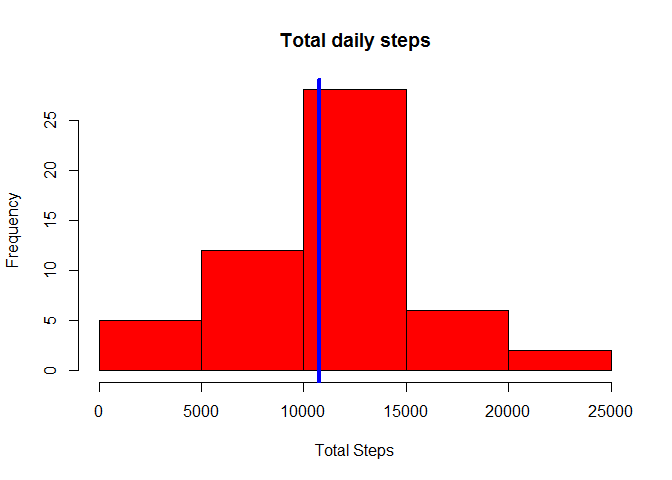
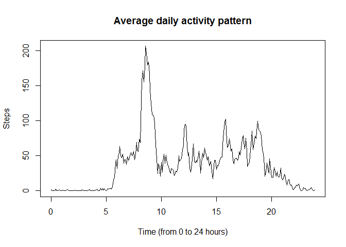
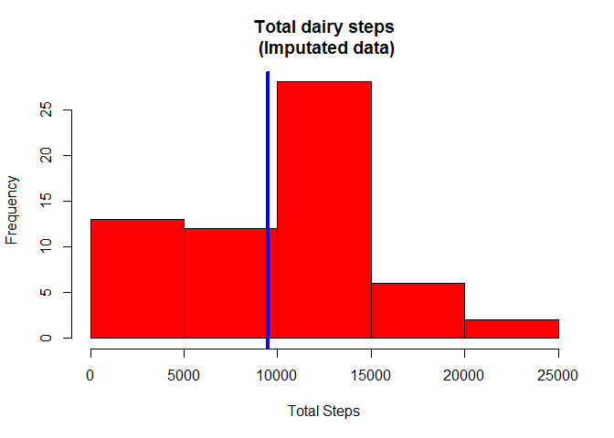
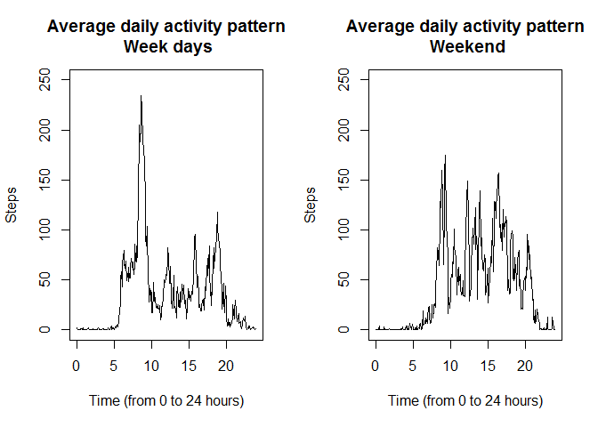

# Reproducible Research: Peer Assessment 1
I. Llatas  
February 7, 2016  


## Loading and preprocessing the data

The data is in a .zip file and contains three columns, **steps**(integer),**date**(character/factor) and **inteval** (integer).
date needs to be of type POSIXlt.


```r
unzip("activity.zip")
activity<-read.csv("activity.csv")
Date<-strptime(as.character(activity[,2]),"%Y-%m-%d")
```


## What is mean total number of steps taken per day?
This is a basic statistics.  To answer that, we need to calculate the total number of steps taken each day and average them. In the next figure, the histogram of this number is presented.  The blue line indicates the mean total number of steps


```r
total.steps=with(activity,aggregate(steps~date, FUN=sum,na.rm=TRUE))
 hist(total.steps$steps,col="red", main="Total daily steps",xlab="Total Steps")
 abline(v=mean(total.steps$steps),lwd=4,col="blue")
```



```r
 mean(total.steps$steps)
```

```
## [1] 10766.19
```

```r
 median(total.steps$steps)
```

```
## [1] 10765
```

## What is the average daily activity pattern?
To answer this question we can see the time series of average steps over days.

```r
av.act<-with(activity,aggregate(steps~interval,FUN=function(x) mean(x,na.rm=TRUE)))
with(av.act,ts.plot(ts(steps,freq=12,start=0),xlab="Time (from 0 to 24 hours)",ylab="Steps",main="Average daily activity pattern"))
```



```r
# Which is the interval of maximum activity?
max.act.time=with(av.act,which.max(steps))
#Or in hours
av.act$interval[max.act.time]
```

```
## [1] 835
```

```r
# It must be read as hour/minute
```

## Imputing missing values
One way to do the imputation is to substitute the NA by the median value for the steps of the same interval. I choose the median instead of the mean to be more "conservative" in case there are some large outliers in the daily data


```r
median.act<-with(activity,aggregate(steps~interval,FUN=function(x) median(x,na.rm=TRUE)))

x<-activity[,1]
y<-activity[,3]
for(i in unique(y)){
  x[is.na(x)&(y==i)]<-median.act$steps[median.act$interval==i]}

#create a new data.frame
activity.i<-activity
activity.i[,1]<-x

total.steps=with(activity.i,aggregate(steps~date, FUN=sum,na.rm=TRUE))
 hist(total.steps$steps,col="red", main="Total dairy steps\n (Imputated data)",xlab="Total Steps")
 abline(v=mean(total.steps$steps),lwd=4,col="blue")
```



```r
 mean(total.steps$steps)
```

```
## [1] 9503.869
```

```r
 median(total.steps$steps)
```

```
## [1] 10395
```

The distribution has been altered, now there is a non normal pattern, skewed to the left.  


```r
round(100*sum(is.na(activity[,1]))/length(activity[,1]),2)
```

```
## [1] 13.11
```

That may be explained by percentage of missing values.

## Are there differences in activity patterns between weekdays and weekends?


```r
week.days=weekdays(Date)
 week.end=(week.days=="Saturday"|week.days=="Sunday")
activity.wd=activity[!week.end,]
activity.we=activity[week.end,]
av.act.wd<-with(activity.wd,aggregate(steps~interval,FUN=function(x) mean(x,na.rm=TRUE)))
av.act.we<-with(activity.we,aggregate(steps~interval,FUN=function(x) mean(x,na.rm=TRUE)))
par(mfrow=c(1,2))
with(av.act.wd,ts.plot(ts(steps,freq=12,start=0),xlab="Time (from 0 to 24 hours)",ylab="Steps",main="Average daily activity pattern\n Week days", ylim=c(0,250)))
with(av.act.we,ts.plot(ts(steps,freq=12,start=0),xlab="Time (from 0 to 24 hours)",ylab="Steps",main="Average daily activity pattern\n Weekend",ylim=c(0,250)))
```



Clearly there are differences in the activity patterns.
